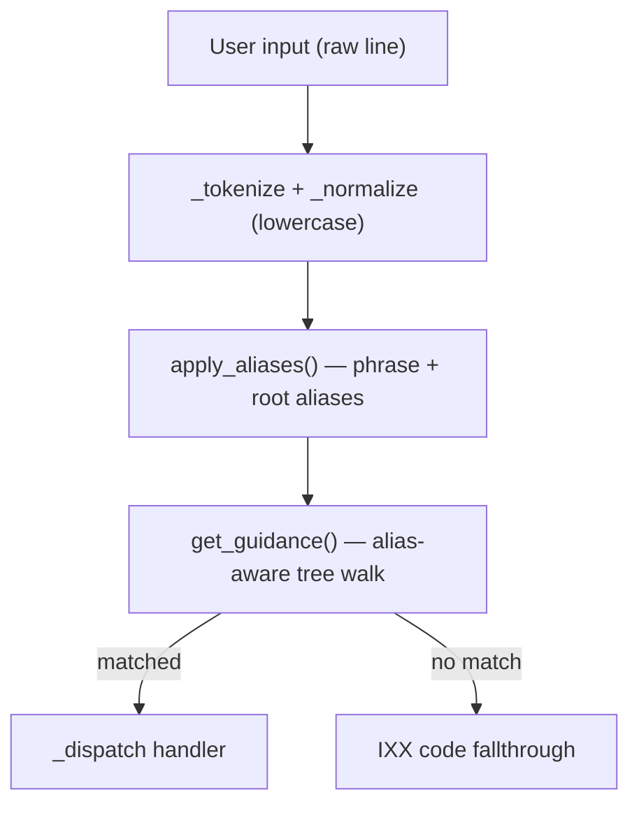
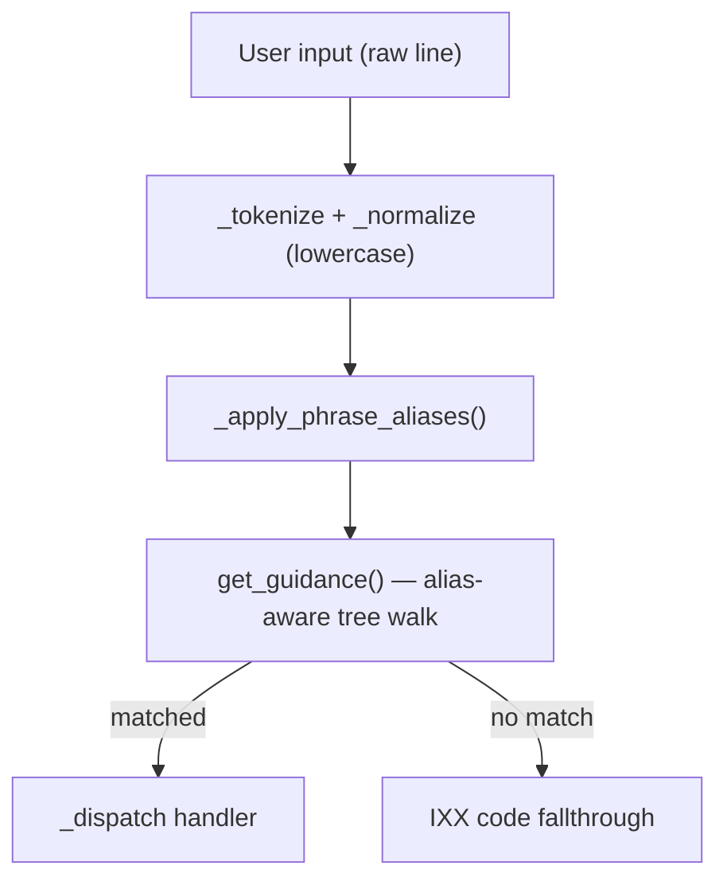

# IXX Direction Correction + Command Normalization

## Pre-pass — Version centralization

### New file: [`ixx/_version.py`](ixx/_version.py)
```python
VERSION = "0.3.5"
```

### Modified: [`ixx/__main__.py`](ixx/__main__.py) and [`ixx/shell/repl.py`](ixx/shell/repl.py)
Remove hardcoded `VERSION = "..."` and replace with:
```python
from ._version import VERSION   # in __main__.py
from .._version import VERSION  # in shell/repl.py
```
This is the one-line fix. All future version bumps touch one file only.

---

## Part 1 — Demo fixes (2 files)

### [`ixx/shell/commands/demo_walk.py`](ixx/shell/commands/demo_walk.py)

**Fix 1 — Step 3 "Numbers and math"**: IXX interpolation resolves variables only, not expressions. Replace:
```python
'x = 10\ny = 3\nsay "Sum: {x + y}"\nsay "Product: {x * y}"'
```
with:
```python
'x = 10\ny = 3\nsum = x + y\nproduct = x * y\nsay "Sum: {sum}"\nsay "Product: {product}"'
```

**Fix 2 — Step 9 "Lists and contains"**: Use real IXX list syntax instead of comma-in-string:
```python
'fruits = "apple", "banana", "mango"\n...'
```

---

## Part 2 — Vision and docs update (3 files)

### [`README.md`](README.md)
- Replace the "This is prototype v0" section framing. Keep the grounded current-status wording but add a clear endgame statement.
- New framing: IXX starts on top of Python/native tools. Long-term goal is to become the default human-facing command layer for CMD/PowerShell/Bash/WSL/SSH/scripting workflows. Native tools become implementation details and escape hatches.
- Endgame identity: *Native underneath. IXX on top. Eventually: IXX everywhere.*

### [`OVERVIEW.md`](OVERVIEW.md)
- Rewrite section 10 "What IXX is not":
  > IXX is not trying to clone every advanced feature of PowerShell, CMD, Bash, Python, or SSH on day one. IXX is trying to replace the user-facing need for those tools over time by covering common useful workflows with a cleaner, human-first interface. Native tools remain available as escape hatches, but the goal is for most users to live in IXX.
- Update section 1 and section 9 to reflect the bigger endgame. IXX is for users first, but not only beginners — simple things stay simple, advanced things become understandable.

### [`spec/roadmap.md`](spec/roadmap.md)
- Add command normalization as a completed v0.3.x feature.
- Add a "Functions (v0.4.0)" section: function definitions, call stack, scope, return values — major language feature requiring grammar + interpreter + AST changes. Planned next major language release after shell stabilization.
- Update vision wording away from "wrapper" framing.

---

## Part 3 — Command normalization system (5 files)

### Architecture



The alias resolution happens in two stages:
1. **Phrase aliases** (multi-word reordering): applied to the full token list before guidance
2. **Node-level aliases** (single-token synonyms): checked inside the guidance tree walk

**Destructive commands are never normalized**: `delete`, `kill`, `copy`, `move`, `native`, `ssh`, `server`, `servers` — fuzzy suggestions are fine but these never execute through synonym normalization.

### New file: [`ixx/shell/aliases.py`](ixx/shell/aliases.py)

```python
# Root-level single-token aliases (safe commands only)
ROOT_ALIASES: dict[str, str] = {
    "memory":    "ram",
    "processor": "cpu",
    "storage":   "disk",
    "drive":     "disk",
    "drives":    "disk",
    # address/addresses -> ip is intentionally limited:
    # only safe because phrase aliases below catch the specific cases.
    # Bare "address" -> ip is NOT added to ROOT_ALIASES to avoid
    # future ambiguity with contacts/address-book features.
}

# Multi-word phrase aliases: tuple of tokens -> canonical token tuple
PHRASE_ALIASES: dict[tuple[str, ...], tuple[str, ...]] = {
    # IP / network
    ("wifi", "ip"):                  ("ip", "wifi"),
    ("ethernet", "ip"):              ("ip", "ethernet"),
    ("network", "wifi", "ip"):       ("ip", "wifi"),
    ("network", "ethernet", "ip"):   ("ip", "ethernet"),
    ("wifi", "address"):             ("ip", "wifi"),
    ("ethernet", "address"):         ("ip", "ethernet"),
    ("network", "address"):          ("ip",),         # bare ip overview

    # RAM / memory
    ("memory", "used"):              ("ram", "usage"),
    ("memory", "usage"):             ("ram", "usage"),
    ("memory", "free"):              ("ram", "free"),
    ("memory", "available"):         ("ram", "free"),
    ("memory", "total"):             ("ram", "total"),
    ("memory", "speed"):             ("ram", "speed"),

    # CPU / processor
    ("processor", "cores"):          ("cpu", "core-count"),
    ("processor", "threads"):        ("cpu", "core-count"),
    ("processor", "usage"):          ("cpu", "usage"),
    ("processor", "used"):           ("cpu", "usage"),

    # Disk / storage
    ("storage", "usage"):            ("disk", "space"),
    ("storage", "used"):             ("disk", "space"),
    ("storage", "space"):            ("disk", "space"),

    # Folder size — known path aliases only
    ("downloads", "size"):           ("folder", "size", "downloads"),
    ("desktop", "size"):             ("folder", "size", "desktop"),
    ("documents", "size"):           ("folder", "size", "documents"),
    ("home", "size"):                ("folder", "size", "home"),
    ("size", "downloads"):           ("folder", "size", "downloads"),
    ("size", "desktop"):             ("folder", "size", "desktop"),
    ("size", "documents"):           ("folder", "size", "documents"),
    ("size", "home"):                ("folder", "size", "home"),
}

# Commands that must NEVER be executed via loose normalization
PROTECTED_COMMANDS = frozenset([
    "delete", "kill", "copy", "move", "native", "ssh", "server", "servers"
])
```

`apply_aliases(tokens)` checks phrase aliases first (full match, then prefix match), then root aliases on token[0]. If the resolved first token is in `PROTECTED_COMMANDS`, normalization is aborted and original tokens returned.

### Modified: [`ixx/shell/registry.py`](ixx/shell/registry.py)

Add `aliases` field to `CommandNode`:
```python
aliases: list[str] = field(default_factory=list)
```

### Modified: [`ixx/shell/guidance.py`](ixx/shell/guidance.py)

Alias-aware child lookup:
```python
def _find_child(node: CommandNode, tok: str) -> CommandNode | None:
    if tok in node.subcommands:
        return node.subcommands[tok]
    for child in node.subcommands.values():
        if tok in child.aliases:
            return child
    return None
```

Root-level: when `registry.get(tokens[0])` returns None, check `ROOT_ALIASES` from `aliases.py` and retry.

### Modified: [`ixx/shell/repl.py`](ixx/shell/repl.py)

Call `apply_aliases(tokens)` after `_normalize()` before `_dispatch()`. Preserve original raw line for error messages.

### Modified: [`ixx/shell/commands/stubs.py`](ixx/shell/commands/stubs.py)

**RAM** subcommand aliases:
- `usage`: `aliases=["used", "use"]`
- `free`: `aliases=["available", "avail"]` (RAM only — not disk)
- New `total` subcommand → `handle_ram` with description "Total installed RAM (see also: ram)"

**CPU** subcommand aliases:
- `core-count`: `aliases=["cores", "threads", "corecount"]`
- New `usage` subcommand → `handle_cpu` with description "CPU usage overview (see also: cpu)"

**Disk** subcommands:
- `space`: `aliases=["usage", "used"]` — NOT "free" (disk space shows total/used/free, routing `disk free` here is fine since it shows all three)

**Protected commands** (`delete`, `kill`, `copy`, `move`, `native`, `ssh`, `server`, `servers`): no aliases added.

### Modified: [`ixx/shell/renderer.py`](ixx/shell/renderer.py)

`show_help()` for a command: show canonical commands and examples first, then "Also accepts:" section listing aliases. Aliases do not appear in the main command list — canonical names only there.

```
ram — Total, used, free RAM and speed

  ram
  ram usage
  ram free
  ram speed

  Also accepts:
    memory               (same as ram)
    ram used             → ram usage
    ram available        → ram free
    memory used/free/total/speed
```

---

## Part 4 — Tests

New file: [`tests/test_normalization.py`](tests/test_normalization.py)

Tests assert **handler output behavior**, not just token remapping:
- `ram used` output contains "Used"
- `memory free` output contains "Free"
- `ram available` output contains "Free"
- `cpu cores` output contains "Cores" or "Threads"
- `processor cores` output same as `cpu core-count`
- `wifi ip` output same as `ip wifi`
- `ethernet ip` output same as `ip ethernet`
- `storage usage` output same as `disk space`
- `downloads size` output same as `folder size downloads`
- `IP WIFI` → same as `ip wifi` (case insensitive)
- `RAM USED` → same as `ram usage`
- `ram total` hits the ram handler and shows total
- Typo `ram useed` still gets a fuzzy suggestion (normalization + fuzzy cooperate, not conflict)

---

## File change summary

| File | Type of change |
|---|---|
| `ixx/_version.py` | New — single source of truth for VERSION |
| `ixx/__main__.py` | Import VERSION from `_version` |
| `ixx/shell/repl.py` | Import VERSION from `_version`, call `apply_aliases()` |
| `ixx/shell/aliases.py` | New — alias maps and `apply_aliases()` |
| `ixx/shell/registry.py` | Add `aliases` field to `CommandNode` |
| `ixx/shell/guidance.py` | Alias-aware child lookup, root alias fallback |
| `ixx/shell/commands/stubs.py` | Add `aliases=` to nodes, add `ram total` + `cpu usage` |
| `ixx/shell/renderer.py` | Show "Also accepts:" in help output (canonical first) |
| `ixx/shell/commands/demo_walk.py` | Fix math step, fix list syntax |
| `README.md` | Vision reframe + endgame statement |
| `OVERVIEW.md` | Rewrite section 10, update section 1 + 9 |
| `spec/roadmap.md` | Add normalization entry, functions v0.4.0, vision update |
| `tests/test_normalization.py` | New — alias normalization test suite (output-asserting) |

# IXX Direction Correction + Command Normalization

## Part 1 — Demo fixes (2 files)

### [`ixx/shell/commands/demo_walk.py`](ixx/shell/commands/demo_walk.py)

**Fix 1 — Step 3 "Numbers and math"**: IXX interpolation resolves variables only, not expressions. Replace:
```python
'x = 10\ny = 3\nsay "Sum: {x + y}"\nsay "Product: {x * y}"'
```
with:
```python
'x = 10\ny = 3\nsum = x + y\nproduct = x * y\nsay "Sum: {sum}"\nsay "Product: {product}"'
```

**Fix 2 — Step 9 "Lists and contains"**: Use real IXX list syntax instead of comma-in-string:
```python
'fruits = "apple", "banana", "mango"\n...'
```

---

## Part 2 — Vision and docs update (3 files)

### [`README.md`](README.md)
- Replace the "This is prototype v0" section framing. Keep the grounded current-status wording but add a clear endgame statement.
- Replace or remove any wording that makes IXX sound permanently small/limited.
- New framing: IXX starts on top of Python/native tools. Long-term goal is to become the default human-facing command layer for CMD/PowerShell/Bash/WSL/SSH/scripting workflows. Native tools become implementation details and escape hatches.

### [`OVERVIEW.md`](OVERVIEW.md)
- Rewrite section 10 "What IXX is not" to match the corrected direction:
  > IXX is not trying to clone every advanced feature of PowerShell, CMD, Bash, Python, or SSH on day one. IXX is trying to replace the user-facing need for those tools over time by covering common useful workflows with a cleaner, human-first interface. Native tools remain available as escape hatches, but the goal is for most users to live in IXX.
- Update section 1 and section 9 to reflect the bigger endgame.

### [`spec/roadmap.md`](spec/roadmap.md)
- Add a "Command normalization" entry to the Phase 0.x completed features once implemented.
- Update any wording that describes IXX as "just a wrapper."

---

## Part 3 — Command normalization system (5 files)

### Architecture



The alias resolution happens in two stages:
1. **Phrase aliases** (multi-word reordering): applied to the full token list before guidance
2. **Node-level aliases** (single-token synonyms): checked inside the guidance tree walk

### New file: [`ixx/shell/aliases.py`](ixx/shell/aliases.py)

Centralizes all alias definitions. Two structures:

```python
# Root-level single-token aliases: alternate_name -> canonical_name
ROOT_ALIASES: dict[str, str] = {
    "memory":    "ram",
    "processor": "cpu",
    "storage":   "disk",
    "drive":     "disk",
    "drives":    "disk",
    "address":   "ip",
    "addresses": "ip",
}

# Multi-word phrase aliases: tuple of tokens -> canonical token tuple
PHRASE_ALIASES: dict[tuple[str, ...], tuple[str, ...]] = {
    ("wifi", "ip"):              ("ip", "wifi"),
    ("ethernet", "ip"):          ("ip", "ethernet"),
    ("network", "wifi", "ip"):   ("ip", "wifi"),
    ("network", "ethernet", "ip"): ("ip", "ethernet"),
    ("size", "downloads"):       ("folder", "size", "downloads"),
    ("downloads", "size"):       ("folder", "size", "downloads"),
    ("memory", "used"):          ("ram", "usage"),
    ("memory", "usage"):         ("ram", "usage"),
    ("memory", "free"):          ("ram", "free"),
    ("memory", "available"):     ("ram", "free"),
    ("memory", "total"):         ("ram", "total"),
    ("memory", "speed"):         ("ram", "speed"),
    ("processor", "cores"):      ("cpu", "core-count"),
    ("processor", "threads"):    ("cpu", "core-count"),
    ("processor", "usage"):      ("cpu", "usage"),
    ("processor", "used"):       ("cpu", "usage"),
    ("storage", "usage"):        ("disk", "space"),
    ("storage", "used"):         ("disk", "space"),
    ("storage", "space"):        ("disk", "space"),
}
```

Add a function `apply_aliases(tokens: list[str]) -> list[str]` that:
1. Checks the full token tuple against `PHRASE_ALIASES` (exact and prefix)
2. Falls back to checking `ROOT_ALIASES` on the first token only

### Modified: [`ixx/shell/registry.py`](ixx/shell/registry.py)

Add `aliases` field to `CommandNode`:
```python
aliases: list[str] = field(default_factory=list)
```

No other changes needed — alias resolution happens in guidance/aliases layer, not in the registry itself.

### Modified: [`ixx/shell/guidance.py`](ixx/shell/guidance.py)

Replace the direct dict lookup with an alias-aware child finder:

```python
def _find_child(node: CommandNode, tok: str) -> CommandNode | None:
    if tok in node.subcommands:
        return node.subcommands[tok]
    for child in node.subcommands.values():
        if tok in child.aliases:
            return child
    return None
```

Use `_find_child` in the tree walk instead of `node.subcommands.get(tok)`.

Root-level lookup in `get_guidance` uses `ROOT_ALIASES` from `aliases.py` as a fallback when `registry.get(tokens[0])` returns None.

### Modified: [`ixx/shell/repl.py`](ixx/shell/repl.py)

In the main loop and `run_command_once`, call `apply_aliases(tokens)` after `_normalize()` and before `_dispatch()`. The original raw line is preserved for error messages.

### Modified: [`ixx/shell/commands/stubs.py`](ixx/shell/commands/stubs.py)

Add `aliases` to the relevant CommandNodes. Key additions:

- `ram` subcommands:
  - `usage`: `aliases=["used", "use"]`
  - `free`: `aliases=["available", "avail"]`
  - Add new `total` subcommand → `handle_ram` (overview already shows total)
- `cpu` subcommands:
  - `core-count`: `aliases=["cores", "threads", "corecount"]`
  - Add new `usage`/`used` subcommand → `handle_cpu` (overview shows usage)
- `disk` subcommands:
  - `space`: `aliases=["usage", "used", "free"]`

Destructive commands (`delete`, `kill`, `copy`, `move`, `native`, `ssh`) do NOT get forgiving aliases. They can still appear in fuzzy suggestions but will not execute via normalized alias paths.

### Modified: [`ixx/shell/renderer.py`](ixx/shell/renderer.py)

Update `show_help()` to display aliases when present:
```
ram — Total, used, free RAM and speed

Usage:
  ram
  ram usage
  ram free
  ram speed

Also accepts:
  memory
  ram used  →  ram usage
  ram available  →  ram free
  memory used, memory free, memory total ...
```

---

## Part 4 — Tests

New file: [`tests/test_normalization.py`](tests/test_normalization.py)

Cover every case from the spec:
- `ram used` → routes to ram usage handler
- `ram available` → routes to ram free handler
- `memory used` → routes to ram usage handler
- `memory total` → routes to ram (overview)
- `cpu cores` → routes to cpu core-count handler
- `processor cores` → routes to cpu core-count handler
- `storage usage` → routes to disk space handler
- `wifi ip` → routes to ip wifi handler
- `ethernet ip` → routes to ip ethernet handler
- `size downloads` → routes to folder size handler (with "downloads" arg)
- `downloads size` → same
- `IP WIFI` → routes to ip wifi (case insensitive)
- `RAM USED` → routes to ram usage
- Typo `ram useed` still gets fuzzy suggestion (normalization + correction cooperate)

---

## File change summary

| File | Type of change |
|---|---|
| `ixx/shell/aliases.py` | New — alias maps and `apply_aliases()` |
| `ixx/shell/registry.py` | Add `aliases` field to `CommandNode` |
| `ixx/shell/guidance.py` | Alias-aware child lookup, root alias fallback |
| `ixx/shell/repl.py` | Call `apply_aliases()` before dispatch |
| `ixx/shell/commands/stubs.py` | Add `aliases=` to nodes, add `ram total` + `cpu usage` |
| `ixx/shell/renderer.py` | Show "Also accepts:" in help output |
| `ixx/shell/commands/demo_walk.py` | Fix math step, fix list syntax |
| `README.md` | Vision reframe |
| `OVERVIEW.md` | Rewrite section 10, update section 1 + 9 |
| `spec/roadmap.md` | Add normalization entry, update vision wording |
| `tests/test_normalization.py` | New — alias normalization test suite |