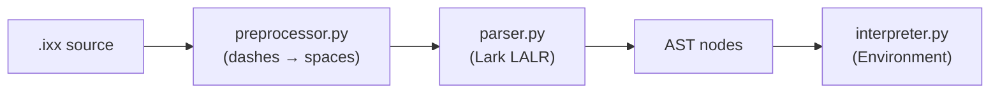

# IXX Redesign Plan

## What is changing

### 1. Syntax refinements

| Old | New |
|---|---|
| `otherwise` | `else` |
| `isnt` | `is not` |
| `above` | `more than` |
| `below` | `less than` |
| `atleast` | `at least` |
| `atmost` | `at most` |
| *(new)* | `contains` |
| *(new)* | `"Hello, {name}"` string interpolation |
| *(new)* | `items = "apple", "banana", "grape"` list literal |

The canonical examples from your spec will all parse and run:

```text
age = 19

if age less than 18
- say "Not adult"
else
- say "Adult"
```

```text
name = "Ixxy"
say "Hello, {name}"
```

```text
items = "apple", "banana", "grape"

if items contains "banana"
- say "Found it"
```

### 2. Grammar changes — [ixx/grammar.lark](ixx/grammar.lark)

**Multi-word operators** cannot be a single terminal (spaces are ignored between tokens). Instead, each keyword becomes its own high-priority terminal, and the `compare` rule matches them as sequences:

```lark
?compare: add_expr
        | compare IS add_expr            -> op_is
        | compare IS NOT_KW add_expr     -> op_is_not
        | compare LESS THAN_KW add_expr  -> op_less_than
        | compare MORE THAN_KW add_expr  -> op_more_than
        | compare AT LEAST_KW add_expr   -> op_at_least
        | compare AT MOST_KW add_expr    -> op_at_most
        | compare CONTAINS add_expr      -> op_contains

IS.1:       "is"
NOT_KW.1:   "not"
LESS.1:     "less"
MORE.1:     "more"
THAN_KW.1:  "than"
AT.1:       "at"
LEAST_KW.1: "least"
MOST_KW.1:  "most"
CONTAINS.1: "contains"
```

Left-recursive `compare` means LALR(1) can look one token ahead to decide between `is` (equality) and `is not` (inequality) cleanly without conflicts.

`NOT_KW.1` replaces the inline `"not"` in `not_expr` too, for consistency.

`else` replaces `otherwise` in `if_stmt`.

**List literal:**

```lark
list_lit: expr "," expr ("," expr)*

assignment: IDENTIFIER "=" list_lit
          | IDENTIFIER "=" expr
```

The `list_lit` rule requires at least two comma-separated items so a plain `x = 5` still gives a single value, not a one-item list.

### 3. AST changes — [ixx/ast_nodes.py](ixx/ast_nodes.py)

- Add `ListLit(items: list[Expr])` expression node.
- Update `IXXValue` type to include `list`.
- `Compare.ops` strings become: `"is"`, `"is not"`, `"less than"`, `"more than"`, `"at least"`, `"at most"`, `"contains"`.
- Remove unused `Optional` import.

### 4. Transformer changes — [ixx/build_ast.py](ixx/build_ast.py)

- Add named methods for each new compare rule: `op_is`, `op_is_not`, `op_less_than`, etc. Each returns `Compare(ops=[...], operands=[...])`.
- Add `list_lit` method returning `ListLit`.
- Remove unused `Token` import.

### 5. Interpreter changes — [ixx/interpreter.py](ixx/interpreter.py)

**String interpolation** — handled at eval time, not parse time. When evaluating a `StrLit`, scan for `{varname}` patterns and replace each with the current environment value:

```python
import re

def _interpolate(self, text: str, env: Environment) -> str:
    def replace(m):
        name = m.group(1)
        try:
            return _display(env.get(name))
        except IXXRuntimeError:
            return m.group(0)   # leave {name} as-is if not defined
    return re.sub(r'\{([A-Za-z_][A-Za-z0-9_]*)\}', replace, text)
```

**`contains` comparison:**

```python
case "contains":
    if isinstance(a, list): result = b in a
    elif isinstance(a, str): result = str(b) in a
    else: raise IXXRuntimeError(...)
```

**List display:** `_display` for a list shows its items space-separated (or comma-separated — TBD, can choose at implementation time).

Update `_eval_compare` to cover all new operator names.

### 6. CLI expansion — [ixx/__main__.py](ixx/__main__.py)

Expand from `ixx <file>` to:

```
ixx file.ixx              run directly (shorthand)
ixx run file.ixx          run explicitly
ixx check file.ixx        parse only, report syntax errors
ixx version               print version
ixx help                  print overview + command list
```

Parse `sys.argv[1]` to dispatch:
- If it ends in `.ixx`, treat as `run`.
- If it matches a subcommand name, dispatch to that handler.

### 7. Update examples — [examples/](examples/)

Rewrite `hello.ixx` and `advanced.ixx` to use the new syntax. Add dedicated example files per spec:

- `examples/hello.ixx` — `say "Hello World"`
- `examples/condition.ixx` — the age/adult example
- `examples/lists.ixx` — the items/contains example
- `examples/system-info.ixx` — placeholder showing `cpu`, `ram`, `ip` as future built-ins
- `examples/files.ixx` — placeholder showing `folder size downloads`, `open desktop`

### 8. Project structure

Add alongside the existing `ixx/` package:

```
/spec/
  language.md      — formal IXX language spec (syntax, operators, types, scoping)
  shell.md         — IXX console/shell design (commands, guidance, path aliases)
  roadmap.md       — standalone runtime direction (Rust/Go/Zig/C# AOT, phases)

/docs/
  getting-started.md

/tests/            — empty for now, structure ready
```

`ixx/` (the Python prototype) stays as-is. The `spec/` documents make clear that Python is the prototype, not the final runtime.

### 9. Spec documents

`spec/language.md` covers:
- Block syntax (dash rules)
- All comparison operators with examples
- String interpolation `{varname}`
- List literals and `contains`
- `and`, `or`, `not` logic
- Arithmetic `+ - * /`
- `YES`/`NO` (case-insensitive)
- Scoping rules
- Comment syntax `#`

`spec/shell.md` covers (design, not yet implemented):

**Built-in system commands** — a full table of `cpu`, `ram`, `disk`, `ip wifi`, `folder size`, `find file`, `open`, `delete`, `copy`, `move`, `kill process`, etc., each with their argument shape.

**Path aliases** — `desktop`, `downloads`, `documents`, `pictures`, `music`, `videos`, `home`, `temp`, `appdata`, `here` / `.`. Forward-slash paths work on all platforms. Quoted paths for names with spaces.

**Safety behavior** — confirmation prompts before destructive actions, dry-run mode, force flag for scripts, clear admin-required warnings, friendly error explanations.

**Native passthrough** — `native "..."`, `ps "..."`, `cmd "..."`, `sh "..."` as explicit escape hatches. Secondary, not the default path.

**CLI subcommands** — `ixx`, `ixx run`, `ixx shell`, `ixx do "..."`, `ixx help`, `ixx version`, `ixx check`, `ixx fmt`.

**Live grammar-aware command guidance** — this is a first-class design goal of the IXX shell, not a footnote.

The shell must understand the current partial command at every keystroke and show what can come next. This is not dumb string autocomplete. The guidance engine knows the grammar of every built-in command and shows valid continuations, argument types, examples, warnings, and descriptions in real time.

Examples the spec must document precisely:

```
User types:   cpu
Guidance:     usage  core-count  temperature  speed  info

User types:   disk
Guidance:     list  health  space  partitions  mounts

User types:   disk health
Guidance:     all  disk 0  disk 1  C:  D:

User types:   delete
Guidance:
  delete file <path>
  delete folder <path> [recursive] [force] [dry-run]
  delete temp
  delete empty-trash

User types:   copy
Guidance:     copy <source> to <destination>

User types:   find file
Guidance:     find file <name or pattern> [in <path>]
  Examples:
    find file "invoice"
    find file "*.pdf" in downloads
```

For each command, the guidance engine records:
- valid next words and argument types
- short description per option
- whether the option is destructive
- whether admin/root may be needed
- whether the action is immediate or prompts first
- example invocations

The help system ties directly into the same engine:

```
help              — broad categories
help disk         — disk commands
help delete       — delete syntax + examples + safety notes
? disk            — same as help disk
disk ?            — valid next options for disk
delete ?          — valid next options for delete
```

Fuzzy correction is also part of the spec:

```
cpoy file.txt to desktop
→ Did you mean: copy file.txt to desktop?

wifi address
→ Did you mean: wifi ip  or  ip wifi  or  network ip?
```

**Long-term shell project structure:**

```
/shell
  repl/             — interactive loop, input handling, history
  command-guidance/ — grammar tree for built-in commands, next-arg engine
  autocomplete/     — rendering hints inline as user types
  history/          — command history, search
  rendering/        — output formatting, tables, colors, warnings
```

The guidance engine in `command-guidance/` is the core of the shell's identity. It holds the command grammar as a structured tree (not hard-coded strings), so adding a new command automatically makes it discoverable.

`spec/roadmap.md` covers:
- Phase 0: Python prototype (current)
- Phase 1: Language complete, standalone CLI (PyInstaller or Go/Rust rewrite)
- Phase 2: Shell/REPL with live guidance
- Phase 3: Built-in system commands
- Runtime language candidates: Rust, Go, Zig, C# AOT — tradeoffs noted

## Data flow (unchanged architecture)



## What is NOT changing now

- The Python + Lark stack (prototype v0, that's fine)
- The dash-block preprocessing approach
- The `ixx` command entry point
- The `YES`/`NO` booleans
- Arithmetic operators `+ - * /`
- `and` / `or` / `not` logic keywords
- The `loop` keyword (replaces `while`)
- The `say` keyword (replaces `print`)
