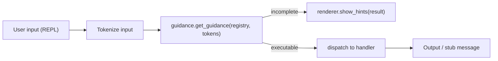

# IXX v0.2.0 Shell Skeleton

## Branch strategy

- `git checkout -b v0.2.0-shell-planning` from the `v0.1.0` tag
- `master` stays untouched at v0.1.0
- Only `CHANGELOG.md` and `spec/roadmap.md` get minor updates on this branch (no wholesale rewrites)

---

## What gets built

```
shell/
  __init__.py
  repl.py          main REPL loop (input, dispatch, history)
  registry.py      CommandNode dataclass + CommandRegistry
  guidance.py      next-arg engine (given partial tokens → what comes next)
  renderer.py      output formatting (hints, tables, warnings, colors)
  commands/
    __init__.py
    stubs.py       seed commands with no-op handlers (proves guidance works)
tests/
  test_shell.py    unit tests for guidance engine + registry
```

Files updated (lightly):
- [`ixx/__main__.py`](ixx/__main__.py) — wire `ixx shell` to launch the real REPL instead of the placeholder message
- [`CHANGELOG.md`](CHANGELOG.md) — add `[0.2.0-dev]` section
- [`spec/roadmap.md`](spec/roadmap.md) — mark Phase 2 as "in progress"

---

## Core data model — `shell/registry.py`

Every built-in command is a `CommandNode`. The tree is pure data — no hardcoded string matching anywhere.

```python
@dataclass
class CommandNode:
    name: str
    description: str = ""
    subcommands: dict[str, "CommandNode"] = field(default_factory=dict)
    arg_hint: str = ""           # e.g. "<path>", "<process-name>"
    examples: list[str] = field(default_factory=list)
    destructive: bool = False
    requires_admin: bool = False
    handler: Callable | None = None  # None = not yet implemented
```

`CommandRegistry` holds the top-level commands and exposes:
- `register(node)` — add a command
- `lookup(tokens)` — walk the tree and return the matching node (or None)
- `root_names()` — all top-level command names (for fuzzy correction)

---

## Guidance engine — `shell/guidance.py`

```python
@dataclass
class GuidanceResult:
    matched_node: CommandNode | None
    next_options: list[str]      # valid next words
    arg_hint: str                # e.g. "<path>"
    examples: list[str]
    is_executable: bool          # True if current tokens form a complete command
    destructive: bool
    requires_admin: bool
```

`def get_guidance(registry, tokens: list[str]) -> GuidanceResult`

Logic: walk the `CommandNode` tree token by token. At each step, collect `subcommands.keys()`. If tokens run out before reaching a leaf, return the next valid words. If tokens match a leaf, mark as executable.

---

## Architecture flow



---

## Seeded commands (stubs, no real OS calls)

These prove the guidance tree works before v0.3.0 system integration:

- `cpu` → subcommands: `usage`, `core-count`, `temperature`, `speed`, `info`
- `ram` → subcommands: `free`, `usage`
- `disk` → subcommands: `list`, `health`, `space`, `partitions`
- `ip` → subcommands: `all`, `wifi`, `ethernet`, `public`, `local`
- `wifi` (leaf, no subcommands)
- `help` (special — calls `show_help` in renderer, fully implemented)
- `exit` / `quit` (fully implemented, closes the shell)

All stub handlers print: `[cpu usage — not yet implemented, coming in v0.3.0]`

---

## REPL loop — `shell/repl.py`

- Prompt: `ixx> `
- Read a line, tokenize it
- Call `get_guidance(registry, tokens)`
- If incomplete: print next options and wait for more input
- If executable: call `node.handler(args)`
- If no match: fuzzy-correct against `registry.root_names()` using `difflib`
- `help`, `?`, `command ?` fully handled
- `exit` / `quit` exits cleanly
- Up-arrow history via Python's `readline` (or `pyreadline3` on Windows)

---

## Tests — `tests/test_shell.py`

- Registry: register nodes, lookup by token path, root names
- Guidance: partial input returns correct next options
- Guidance: complete input returns `is_executable=True`
- Guidance: unknown input returns empty options
- Guidance: destructive flag propagates correctly
- Fuzzy correction: `cpoy` → suggests `copy`
- REPL: `exit` token causes loop to stop

---

## What this does NOT do

- No actual OS calls (`cpu`, `disk`, etc. are all stubs)
- No inline autocomplete while typing (that's a v0.3.0 UX refinement)
- No `ixx do "command"` yet (trivial addition once the REPL dispatches correctly, can add at end)
- No changes to the language interpreter or grammar
