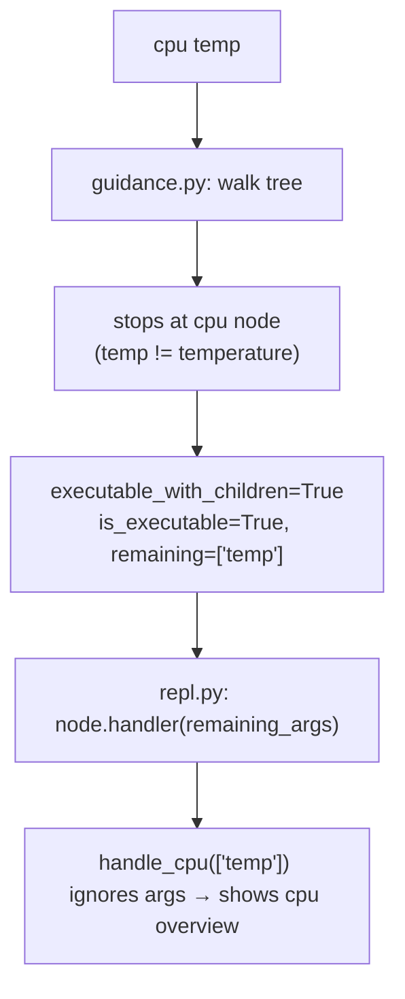

# IXX v0.3.0 Completion

## Scope

Implement additional safe/read-only stub commands that are feasible in v0.3.0.
Keep destructive, native passthrough, SSH/server, and elevated/admin-requiring commands as stubs.

**Deferred to a later version (all are planned, not "never"):**

- `disk health` — requires admin-level SMART access; deferred until elevated-permission flow is designed
- `kill process`, `copy`, `move`, `delete` — destructive; deferred until safety/confirmation flow is designed
- `native` — shell passthrough escape hatch; planned for a later version
- `ssh`, `server`, `servers` — remote access; their own feature category per `spec/roadmap.md`

Linux and macOS platform adapters remain `_not_yet()` stubs. Real implementations are planned once the Windows version is stable.

---

## Section 0 — Startup banner

### Target output

```
┌──────────────────────────────────────┐
│ IXX Shell 0.3.0                      │
│ The language for the user.           │
└──────────────────────────────────────┘

Type help for commands.  Type exit to leave.

ixx>
```

### Implementation

**Add to [`ixx/shell/renderer.py`](ixx/shell/renderer.py):**

```python
_BANNER_SLOGAN = "The language for the user."

def _supports_unicode() -> bool:
    try:
        "│".encode(getattr(sys.stdout, "encoding", None) or "utf-8")
        return True
    except (UnicodeEncodeError, LookupError):
        return False

def show_banner(version: str) -> None:
    width = 40
    if _supports_unicode():
        title   = f" IXX Shell {version}"
        tagline = f" {_BANNER_SLOGAN}"
        print(f"\n┌{'─' * width}┐")
        print(f"│{title:<{width}}│")
        print(f"│{tagline:<{width}}│")
        print(f"└{'─' * width}┘")
    else:
        print(f"\n+{'-' * width}+")
        print(f"| IXX Shell {version:<{width - 11}}|")
        print(f"| {_BANNER_SLOGAN:<{width - 2}}|")
        print(f"+{'-' * width}+")
    print("\nType help for commands.  Type exit to leave.\n")
```

**In [`ixx/shell/repl.py`](ixx/shell/repl.py) `run()`:**
- Import `show_banner` from `.renderer`
- Replace the existing 3-line startup `print()` block with `show_banner(VERSION)`

**Rules:**
- `run_command_once()` does NOT call `show_banner` — no banner for `ixx do "..."`
- `VERSION` is passed in; not hardcoded inside `show_banner`
- No banner for `ixx help`, `ixx version`, or `.ixx` script execution — those never call `run()`

---

## Section 1 — Hardware commands

### New platform functions in [`ixx/shell/platform/windows.py`](ixx/shell/platform/windows.py)

- **`get_cpu_speed()`**
  `Win32_Processor | Select Name, MaxClockSpeed`
  → `{"name": str, "speed_mhz": int}`

- **`get_cpu_temperature()`**
  `Get-WmiObject -Namespace root/wmi -Class MSAcpi_ThermalZoneTemperature -ErrorAction SilentlyContinue`
  `CurrentTemperature` is in tenths of Kelvin: `(value / 10) - 273.15 = Celsius`
  → `[{"zone": str, "celsius": float}, ...]`
  Returns `[]` if the class is missing or no data — never raises.

- **`get_ram_speed()`**
  `Win32_PhysicalMemory | Select Speed`
  → `{"speed_mhz": int}` (max value across sticks; `-` if unavailable)

- **`get_gpu_info()`**
  `Win32_VideoController | Select Name, AdapterRAM, DriverVersion`
  → `[{"name": str, "vram_bytes": int, "driver": str}, ...]`

Add `_not_yet()` stubs for all four to [`linux.py`](ixx/shell/platform/linux.py) and [`macos.py`](ixx/shell/platform/macos.py).

### New handlers in [`ixx/shell/commands/hardware.py`](ixx/shell/commands/hardware.py)

- `handle_cpu_info(args)` — name, cores, threads, speed (from `get_cpu_speed()`), usage; full summary
- `handle_cpu_speed(args)` — `Speed: 4.5 GHz`
- `handle_cpu_temperature(args)` — one line per thermal zone; if `get_cpu_temperature()` returns `[]`, print `Temperature data not available on this hardware.` — not an error
- `handle_ram_free(args)` — `Free: 43.1 GB` (reuses existing `get_ram_info()`)
- `handle_ram_usage(args)` — `Used: 20.9 GB  (33%)` (reuses existing `get_ram_info()`)
- `handle_ram_speed(args)` — `Speed: 3200 MHz`
- `handle_gpu(args)` — name, VRAM, driver per GPU
- `handle_gpu_vram(args)` — VRAM only
- `handle_gpu_driver(args)` — driver version only

### Update [`ixx/shell/commands/stubs.py`](ixx/shell/commands/stubs.py)

- `_build_gpu()`: add `vram` and `driver` subcommands; set `executable_with_children=True`
- Wire all new hardware handlers; remove their `_stub()` calls

---

## Section 2 — Network commands

### New platform functions in [`windows.py`](ixx/shell/platform/windows.py)

- **`get_wifi_info()`**
  `netsh wlan show interfaces` parsed internally, or PowerShell `Get-NetAdapter` + SSID lookup
  → `{"ssid": str, "signal": str, "ipv4": str, "adapter": str}` or `{}` if no Wi-Fi connected

- **`get_public_ip()`**
  `urllib.request.urlopen("https://api.ipify.org", timeout=5)` — stdlib only, no new dependency
  → `str` (the public IP) or `None` if offline or timeout

Add `_not_yet()` stubs to `linux.py` and `macos.py`.

### New handlers in [`ixx/shell/commands/network.py`](ixx/shell/commands/network.py)

- `handle_wifi(args)` — SSID, signal, IP; prints "No Wi-Fi connection found." if `get_wifi_info()` returns `{}`
- `handle_ip_public(args)` — shows public IP with note: `(via external lookup: api.ipify.org)`;
  prints "Could not reach external service." if offline; does NOT run as part of bare `ip`

### Update [`stubs.py`](ixx/shell/commands/stubs.py)

- Wire `handle_wifi` to the `wifi` top-level node
- Wire `handle_ip_public` to the `ip > public` node

---

## Section 3 — System, process, and file commands

### New platform functions in [`windows.py`](ixx/shell/platform/windows.py)

- **`get_ports()`**
  `Get-NetTCPConnection -State Listen | Select LocalPort, OwningProcess | Sort LocalPort`
  → `[{"port": int, "pid": int, "process": str}, ...]`
  Process name resolved via `Get-Process -Id <pid>` or shown as PID if lookup fails.

- **`get_processes()`**
  `Get-Process | Select Name, Id, CPU, WorkingSet | Sort WorkingSet -Desc | Select -First 30`
  → `[{"name": str, "pid": int, "cpu": str, "ram_bytes": int}, ...]`

- **`get_disk_partitions()`**
  `Get-Partition | Select DriveLetter, Size, Type`
  → `[{"letter": str, "size_bytes": int, "type": str}, ...]`

Add `_not_yet()` stubs to `linux.py` and `macos.py`.

### New handlers in [`ixx/shell/commands/system.py`](ixx/shell/commands/system.py)

- `handle_ports(args)` — table: Port | PID | Process
- `handle_processes(args)` — table: Name | PID | CPU | RAM  (top 30 by RAM, sorted descending)
- `handle_disk_partitions(args)` — table: Drive | Size | Type

### `find file` in [`ixx/shell/commands/files.py`](ixx/shell/commands/files.py)

- `handle_find_file(args)` — parses `find file <pattern> [in <path>]`
  - Resolves path alias if `in <alias>` is present, otherwise searches current folder
  - Uses `pathlib.Path.rglob(pattern)`
  - Prints matches in a table: Name | Path | Size
  - Caps results at 50 to avoid flooding the terminal
  - Handles `PermissionError` gracefully

### Update [`stubs.py`](ixx/shell/commands/stubs.py)

Wire `handle_ports`, `handle_processes`, `handle_disk_partitions`, `handle_find_file`.

---

## Section 4 — Bug: unrecognized subcommand runs parent handler

### Root cause



Free-form args are fine: `folder size downloads` walks to the `size` leaf which has no subcommands,
so `remaining_args` on a leaf is valid and passes to the handler correctly.

### Fix in [`ixx/shell/repl.py`](ixx/shell/repl.py) — apply in both `run()` and `run_command_once()`

```python
if result.is_executable:
    node = result.matched_node
    if result.remaining_args and node.subcommands:
        # Unknown token that looks like a subcommand
        unknown_sub = result.remaining_args[0]
        suggestions = difflib.get_close_matches(
            unknown_sub, list(node.subcommands.keys()), n=1, cutoff=0.6
        )
        show_unknown_subcommand(
            " ".join(tokens[:result.depth]), unknown_sub, suggestions
        )
    elif node.handler is not None:
        node.handler(result.remaining_args)
    else:
        show_not_implemented(" ".join(tokens[:result.depth]))
else:
    show_hints(result)
```

### Add to [`ixx/shell/renderer.py`](ixx/shell/renderer.py)

```python
def show_unknown_subcommand(parent: str, unknown: str, suggestions: list[str]) -> None:
    print(f"\n  Unknown option for '{parent}': {unknown}")
    if suggestions:
        print(f"  Did you mean: {parent} {suggestions[0]}?")
    print(f"\n  Type '{parent} ?' to see valid options.\n")
```

---

## Section 5 — Bug: case-sensitive command lookup

**File:** [`ixx/shell/repl.py`](ixx/shell/repl.py)

Typing `CPU`, `Ip`, or `DISK` returns "unknown command" because `registry.get()` is case-sensitive.

Fix: after `_tokenize()`, lowercase all tokens before passing to `get_guidance()`.
Apply in both `run()` and `run_command_once()`. Registry keys are already lowercase.

---

## Section 6 — Bug: 172.16–172.31 mis-classified as virtual

**File:** [`ixx/shell/commands/network.py`](ixx/shell/commands/network.py) — `_classify_adapter()`

Current behavior: any `172.x` IP is classified `virtual`, mislabeling valid RFC 1918 LAN addresses.

Fix:

```python
if ip.startswith("172."):
    parts = ip.split(".")
    second = int(parts[1]) if len(parts) > 1 else 0
    if 16 <= second <= 31:
        return "other"   # valid RFC 1918 172.16.0.0/12 — real LAN
    return "virtual"     # 172.0–172.15 or 172.32+ — likely VM/container
```

`169.254.x.x` link-local classification is correct and unchanged.

---

## Section 7 — Tests

**File:** [`tests/test_v030.py`](tests/test_v030.py)

All new handler tests use a mocked platform adapter.

**`TestBannerOutput`**
- Banner contains "IXX Shell" and `VERSION`
- Banner contains slogan
- `run_command_once` does not print the banner

**`TestNewHardwareCommands`**
- `cpu info` output contains name, cores, threads
- `cpu speed` output contains "GHz" or "MHz"
- `cpu temperature` returns graceful message when platform returns `[]`
- `ram free` output contains "Free"
- `ram usage` output contains "Used" and "%"
- `ram speed` output contains "MHz"
- `gpu` output contains GPU name
- `gpu vram` output contains "VRAM"
- `gpu driver` output contains "Driver"
- `NotImplementedError` (Linux/macOS stub) handled without crash for each

**`TestNewNetworkCommands`**
- `wifi` output contains SSID when connected; prints "No Wi-Fi connection found." when `{}`
- `ip public` output contains the IP and the external-lookup note
- `ip public` prints offline message when `get_public_ip()` returns `None`

**`TestNewSystemCommands`**
- `ports` output contains "Port" header
- `processes` output contains "Name" and "PID"
- `disk partitions` output contains "Drive"

**`TestFindFile`**
- `find file "*.txt"` on a temp directory finds created `.txt` files
- `find file <pattern> in downloads` resolves the alias and searches

**`TestUnknownSubcommand`**
- `cpu temp` → output contains "Unknown option", does NOT contain CPU/cores overview
- `cpu temp` → output suggests `temperature` (fuzzy match)
- `ram fre` → output suggests `free`
- `disk xyz` → output contains "Unknown option"

**`TestCaseInsensitive`**
- `CPU` runs the same as `cpu`
- `Ip` runs the same as `ip`
- `DISK` runs the same as `disk`

**`TestNetworkClassification`**
- `172.16.5.1` → not "virtual"
- `172.31.255.1` → not "virtual"
- `172.15.0.1` → "virtual"
- `172.32.0.1` → "virtual"
- `169.254.1.1` → "link-local"

---

## Section 8 — Version bump and docs pass

**Version bump is the final step.** Keep `0.3.0-dev` throughout implementation.
Only bump after: all tests pass, real commands work manually, no known regressions.

Files to update at final commit:
- [`ixx/__main__.py`](ixx/__main__.py): `"0.3.0-dev"` → `"0.3.0"`
- [`ixx/shell/repl.py`](ixx/shell/repl.py): `"0.3.0-dev"` → `"0.3.0"`
- [`pyproject.toml`](pyproject.toml): `version = "0.1.0"` → `"0.3.0"`
- [`CHANGELOG.md`](CHANGELOG.md): `[0.3.0-dev] — in progress` → `[0.3.0]`, list all new commands, update test count
- [`README.md`](README.md): update test count, add new shell command examples

---

## Section 9 — Update-check design (doc only, no code)

**Add a future section to [`spec/roadmap.md`](spec/roadmap.md) only. Zero code changes.**

### Behavior

- If installed version is current: show nothing
- If a newer stable version exists, show a small non-intrusive line below the banner:
  ```
  Version 0.4.0 available.  Run "update" to get the latest version.
  ```

Rules:
- Do not slow down shell startup
- Do not block the prompt; use a background thread or cached result only
- Cache last check timestamp — do not re-check every launch
- Allow disabling via config or environment variable
- Never auto-update without explicit user action

### Future commands (stubs only for now)

```
update                     Update to the latest stable version
update check               Manually check for updates now
update latest              Install the latest stable version
update version 0.4.0       Install/switch to a specific version

version available          Show available versions
```

### Future configuration

```
IXX_NO_UPDATE_CHECK=1                   environment variable
ixx config update-check off             config file
ixx config update-channel stable|dev    release channel
```
